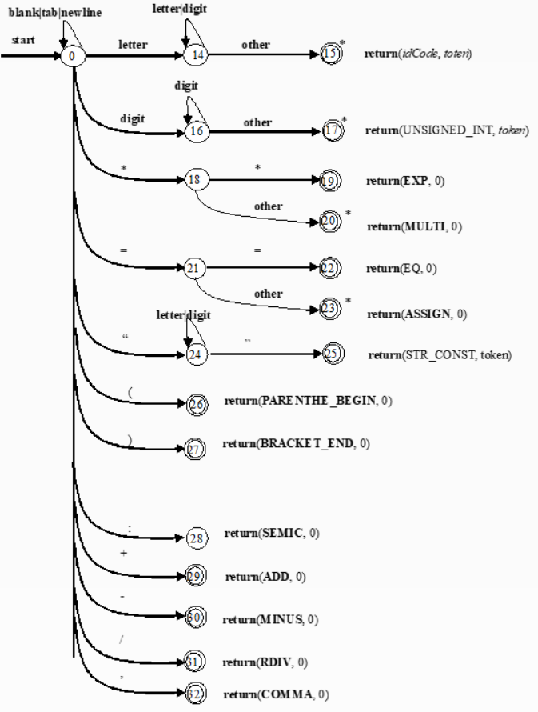

# 编译原理实验

> HITSZ 2022 秋

## 实验一：词法分析

本实验目的为从 `input_code.txt` 输入代码，从 `coding_map.csv` 读取编码表，然后进行词法分析。

### 文法定义

在本次实验中定义一个 C 语言子集“TXT”语言的部分文法如下：

$G=(V,T,P,S)$，$V=\{S,A,B,C,digit,no\_0\_digit,char\}$，$T=\{任意符号\}$

定义 $P$ 如下：

$letter:=$ "a" | "A" | "b" | "B" | "c" | "C" | "d" | "D" | "e" | "E" | "f" | "F" | "g" | "G" | "h" | "H" | "i" | "I" | "j" | "J" | "k" | "K" | "l" | "L" | "m" | "M" | "n" | "N" | "o" | "O" | "p" | "P" | "q" | "Q" | "r" | "R" | "s" | "S" | "t" | "T" | "u" | "U" | "v" | "V" | "w" | "W" | "x" | "X" | "y" | "Y" | "z" | "Z" | "_"

$no\_0\_digit:=$ "1" | "2" | "3" | "4" | "5" | "6" | "7" | "8" | "9"

$digit:=$ "0" | $no\_0\_digit$

标识符：$S \rightarrow letter\ A$，$A\rightarrow letter\ A | digit \ A | \varepsilon$

整常数：$S->no\_0\_digit\ B$，$B\rightarrow digit\ B | \varepsilon$

运算符：$S\rightarrow C$，$C\rightarrow =|*|+|-|/$

### 自动机设计

根据上文文法，可以得到这些正则表达式：

1. `id->letter(letter|digit)*`
2. `intConst->no_0_digit(digit)*`
3. `multi->"*"`
4. `assign->"*" "*"`
5. `parentheBegin->"("`
6. `bracketEnd->")"`
7. `semicolon->";"`
8. `add->"+"`
9. `minus->"-"`
10. `div->"/"`
11. `comma->"."`

将得到的正则表达式合并为状态转化图：



### 代码设计

`Main` 中与词法分析相关的代码：

```java
        // 构建符号表以供各部分使用
        TokenKind.loadTokenKinds();
        final var symbolTable = new SymbolTable();

        // 词法分析
        final var lexer = new LexicalAnalyzer(symbolTable);
        lexer.loadFile(FilePathConfig.SRC_CODE_PATH);
        lexer.run();
        lexer.dumpTokens(FilePathConfig.TOKEN_PATH);
        final var tokens = lexer.getTokens();
        symbolTable.dumpTable(FilePathConfig.OLD_SYMBOL_TABLE);
```

构建了一个符号表，加载了源代码，进行词法分析之后将分析的词法结构导出。

在加载文件时，本程序实现了一个缓冲区方案，能够索引当前指针前后 $n$ 个字符。

```java

    /**
     * 从给予的路径中读取并加载文件内容
     *
     * @param path 路径
     */
    public void loadFile(String path) {
        try {
            iterator = FileCharacterIterator.build(path, 2);
        } catch (IOException e) {
            throw new RuntimeException(e);
        }
    }
```

DFA程序采用经典 3 段有限自动机写法。

```java

    /**
     * 执行词法分析, 准备好用于返回的 token 列表 <br>
     * 需要维护实验一所需的符号表条目, 而得在语法分析中才能确定的符号表条目的成员可以先设置为 null
     */
    public void run() {
        // 自动机实现的词法分析过程
        int state = 0;
        final var accepts = new HashSet<>(Arrays.asList(15, 17, 19, 20, 22, 23, 25, 26, 27, 28, 29, 30, 31, 32));
        final var keyWords = new HashSet<>(Arrays.asList(
                "int",
                "return"
        ));
        StringBuilder idCode = new StringBuilder();
        StringBuilder number = new StringBuilder();
        while (iterator.hasNext()) {
            while (!accepts.contains(state) && iterator.hasNext()) {
                final var c = iterator.current();
                 System.out.printf("[%2d] read: %s, buffer: %s\n", state, c == '\n' ? "\\n" : c, iterator.getBuffer().stream().map(a -> a == '\n' ? ' ' : a).map(Object::toString).reduce((a, b) -> a + b).orElseThrow());
                boolean blank = c == ' ' || c == '\t' || c == '\n';
                boolean digital = '0' <= c && c <= '9';
                boolean letter = ('a' <= c && c <= 'z') || ('A' <= c && c <= 'Z') || c == '_';
                boolean semicolon = c == ';';
                int nextState = switch (state) {
                    case 0 -> switch (c) {
                        case '*' -> 18;
                        case '=' -> 21;
                        case '\"' -> 24;
                        case '(' -> 26;
                        case ')' -> 27;
                        case ';' -> 28;
                        case '+' -> 29;
                        case '-' -> 30;
                        case '/' -> 31;
                        case ',' -> 32;
                        default -> {
                            if (blank) {
                                yield 0;
                            }
                            if (digital) {
                                yield 16;
                            }
                            if (letter) {
                                yield 14;
                            }
                            yield -1;
                        }
                    };
                    case 14 -> (letter || digital) ? 14 : 15;
                    case 16 -> digital ? 16 : 17;
                    case 18 -> c == '*' ? 19 : 20;
                    case 21 -> c == '=' ? 22 : 23;
                    case 24 -> (letter || digital) ? 24 : c == '\"' ? 25 : -1;
                    default -> accepts.contains(state) ? 0 : -1;
                };
                switch (state) {
                    case 0:
                        if (letter) {
                            idCode.append(c);
                        }
                        if (digital) {
                            number.append(c);
                        }
                        break;
                    case 14:
                        if (nextState == 14) {
                            idCode.append(c);
                        }
                    default:
                        break;
                }
                if (accepts.contains(nextState)) {
                    System.out.printf("accept [%d] id=%s, num=%s\n", nextState, idCode, number);
                    tokens.add(switch (nextState) {
                        case 15 -> {
                            final var s = idCode.toString();
                            idCode.setLength(0);
                            if (!keyWords.contains(s) && !symbolTable.has(s)) {
                                symbolTable.add(s);
                            }
                            yield keyWords.contains(s) ? Token.simple(s) : Token.normal("id", s);
                        }
                        case 17 -> {
                            final var token = Token.normal("IntConst", number.toString());
                            number.setLength(0);
                            yield token;
                        }
                        case 19 -> Token.simple("**");
                        case 20 -> Token.simple("*");
                        case 22 -> Token.simple("==");
                        case 23 -> Token.simple("=");
                        case 26 -> Token.simple("(");
                        case 27 -> Token.simple(")");
                        case 28 -> Token.simple("Semicolon");
                        case 29 -> Token.simple("+");
                        case 30 -> Token.simple("-");
                        case 31 -> Token.simple("/");
                        case 32 -> Token.simple(",");
                        default -> throw new RuntimeException(String.format(ErrorDescription.LEX_NO_STATE, state));
                    });
                }
                if (nextState != 28 && semicolon) {
                    System.out.printf("accept [%d] Semicolon\n", nextState);
                    tokens.add(Token.simple("Semicolon"));
                }
                iterator.next();
                state = nextState;
                assert state > 0;
            }
            state = 0;
        }
        System.out.println("accept [$] Done");
        tokens.add(Token.eof());
    }
```

