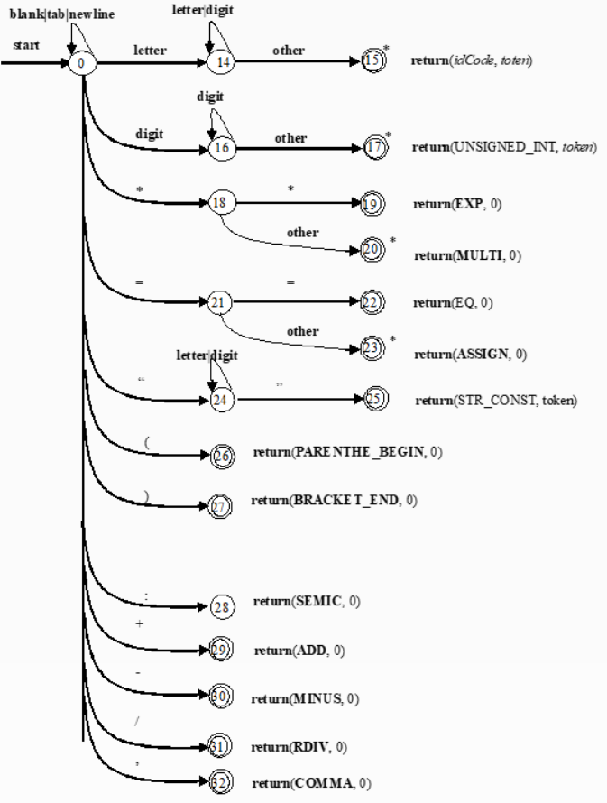
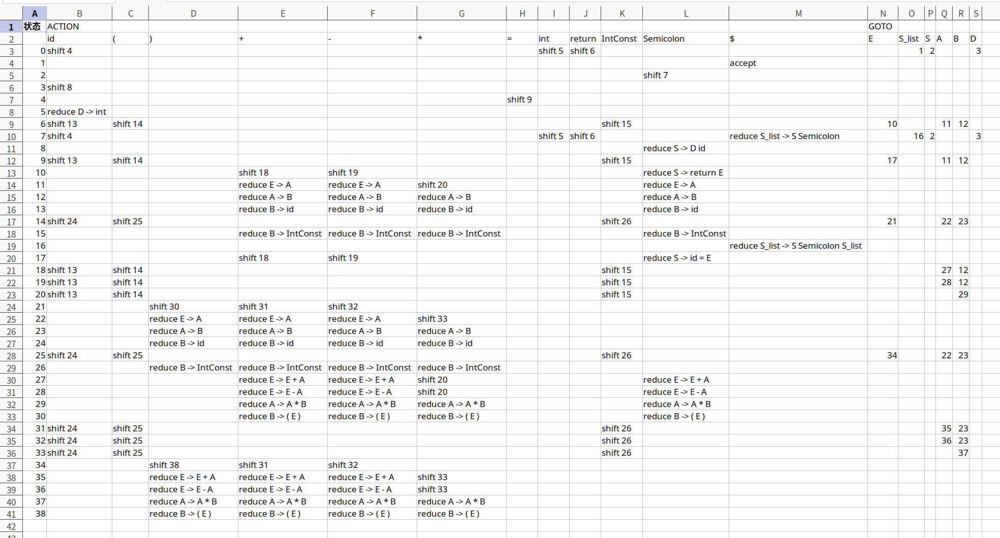

# 《编译原理》实验报告

[toc]

## 实验总体流程与函数功能描述

### 词法分析

本实验目的为从 `input_code.txt` 输入代码，从 `coding_map.csv` 读取编码表，然后进行词法分析。

### 文法定义

在本次实验中定义一个 C 语言子集“TXT”语言的部分文法如下：

$G=(V,T,P,S)$，$V=\{S,A,B,C,digit,no\_0\_digit,char\}$，$T=\{任意符号\}$

定义 $P$ 如下：

$letter:=$ "a" | "A" | "b" | "B" | "c" | "C" | "d" | "D" | "e" | "E" | "f" | "F" | "g" | "G" | "h" | "H" | "i" | "I" | "j" | "J" | "k" | "K" | "l" | "L" | "m" | "M" | "n" | "N" | "o" | "O" | "p" | "P" | "q" | "Q" | "r" | "R" | "s" | "S" | "t" | "T" | "u" | "U" | "v" | "V" | "w" | "W" | "x" | "X" | "y" | "Y" | "z" | "Z" | "_"

$no\_0\_digit:=$ "1" | "2" | "3" | "4" | "5" | "6" | "7" | "8" | "9"

$digit:=$ "0" | $no\_0\_digit$

标识符：$S \rightarrow letter\ A$，$A\rightarrow letter\ A | digit \ A | \varepsilon$

整常数：$S->no\_0\_digit\ B$，$B\rightarrow digit\ B | \varepsilon$

运算符：$S\rightarrow C$，$C\rightarrow =|*|+|-|/$

### 自动机设计

根据上文文法，可以得到这些正则表达式：

1. `id->letter(letter|digit)*`
2. `intConst->no_0_digit(digit)*`
3. `multi->"*"`
4. `assign->"*" "*"`
5. `parentheBegin->"("`
6. `bracketEnd->")"`
7. `semicolon->";"`
8. `add->"+"`
9. `minus->"-"`
10. `div->"/"`
11. `comma->"."`

将得到的正则表达式合并为状态转化图：



### 代码设计

`Main` 中与词法分析相关的代码：

```java
        // 构建符号表以供各部分使用
        TokenKind.loadTokenKinds();
        final var symbolTable = new SymbolTable();

        // 词法分析
        final var lexer = new LexicalAnalyzer(symbolTable);
        lexer.loadFile(FilePathConfig.SRC_CODE_PATH);
        lexer.run();
        lexer.dumpTokens(FilePathConfig.TOKEN_PATH);
        final var tokens = lexer.getTokens();
        symbolTable.dumpTable(FilePathConfig.OLD_SYMBOL_TABLE);
```

构建了一个符号表，加载了源代码，进行词法分析之后将分析的词法结构导出。

在加载文件时，本程序实现了一个缓冲区方案，能够索引当前指针前后 $n$ 个字符。

```java
    /**
     * 从给予的路径中读取并加载文件内容
     *
     * @param path 路径
     */
    public void loadFile(String path) {
        try {
            iterator = FileCharacterIterator.build(path, 2);
        } catch (IOException e) {
            throw new RuntimeException(e);
        }
    }
```

DFA程序采用经典 3 段有限自动机写法。

```java
    /**
     * 执行词法分析, 准备好用于返回的 token 列表 <br>
     * 需要维护实验一所需的符号表条目, 而得在语法分析中才能确定的符号表条目的成员可以先设置为 null
     */
    public void run() {
        // 自动机实现的词法分析过程
        int state = 0;
        final var accepts = new HashSet<>(Arrays.asList(15, 17, 19, 20, 22, 23, 25, 26, 27, 28, 29, 30, 31, 32));
        final var keyWords = new HashSet<>(Arrays.asList(
                "int",
                "return"
        ));
        StringBuilder idCode = new StringBuilder();
        StringBuilder number = new StringBuilder();
        while (iterator.hasNext()) {
            while (!accepts.contains(state) && iterator.hasNext()) {
                final var c = iterator.current();
                 System.out.printf("[%2d] read: %s, buffer: %s\n", state, c == '\n' ? "\\n" : c, iterator.getBuffer().stream().map(a -> a == '\n' ? ' ' : a).map(Object::toString).reduce((a, b) -> a + b).orElseThrow());
                boolean blank = c == ' ' || c == '\t' || c == '\n';
                boolean digital = '0' <= c && c <= '9';
                boolean letter = ('a' <= c && c <= 'z') || ('A' <= c && c <= 'Z') || c == '_';
                boolean semicolon = c == ';';
                int nextState = switch (state) {
                    case 0 -> switch (c) {
                        case '*' -> 18;
                        case '=' -> 21;
                        case '\"' -> 24;
                        case '(' -> 26;
                        case ')' -> 27;
                        case ';' -> 28;
                        case '+' -> 29;
                        case '-' -> 30;
                        case '/' -> 31;
                        case ',' -> 32;
                        default -> {
                            if (blank) {
                                yield 0;
                            }
                            if (digital) {
                                yield 16;
                            }
                            if (letter) {
                                yield 14;
                            }
                            yield -1;
                        }
                    };
                    case 14 -> (letter || digital) ? 14 : 15;
                    case 16 -> digital ? 16 : 17;
                    case 18 -> c == '*' ? 19 : 20;
                    case 21 -> c == '=' ? 22 : 23;
                    case 24 -> (letter || digital) ? 24 : c == '\"' ? 25 : -1;
                    default -> accepts.contains(state) ? 0 : -1;
                };
                switch (state) {
                    case 0:
                        if (letter) {
                            idCode.append(c);
                        }
                        if (digital) {
                            number.append(c);
                        }
                        break;
                    case 14:
                        if (nextState == 14) {
                            idCode.append(c);
                        }
                    default:
                        break;
                }
                if (accepts.contains(nextState)) {
                    System.out.printf("accept [%d] id=%s, num=%s\n", nextState, idCode, number);
                    tokens.add(switch (nextState) {
                        case 15 -> {
                            final var s = idCode.toString();
                            idCode.setLength(0);
                            if (!keyWords.contains(s) && !symbolTable.has(s)) {
                                symbolTable.add(s);
                            }
                            yield keyWords.contains(s) ? Token.simple(s) : Token.normal("id", s);
                        }
                        case 17 -> {
                            final var token = Token.normal("IntConst", number.toString());
                            number.setLength(0);
                            yield token;
                        }
                        case 19 -> Token.simple("**");
                        case 20 -> Token.simple("*");
                        case 22 -> Token.simple("==");
                        case 23 -> Token.simple("=");
                        case 26 -> Token.simple("(");
                        case 27 -> Token.simple(")");
                        case 28 -> Token.simple("Semicolon");
                        case 29 -> Token.simple("+");
                        case 30 -> Token.simple("-");
                        case 31 -> Token.simple("/");
                        case 32 -> Token.simple(",");
                        default -> throw new RuntimeException(String.format(ErrorDescription.LEX_NO_STATE, state));
                    });
                }
                if (nextState != 28 && semicolon) {
                    System.out.printf("accept [%d] Semicolon\n", nextState);
                    tokens.add(Token.simple("Semicolon"));
                }
                iterator.next();
                state = nextState;
                assert state > 0;
            }
            state = 0;
        }
        System.out.println("accept [$] Done");
        tokens.add(Token.eof());
    }
```

### 运行结果

```shell
# java ...
[ 0] read: i, buffer: ￿￿int 
[14] read: n, buffer: ￿￿int 
[14] read: t, buffer: int re
[14] read:  , buffer: int re
accept [15] id=int, num=
[ 0] read: r, buffer: t resu
[14] read: e, buffer: t resu
[14] read: s, buffer: result
[14] read: u, buffer: result
[14] read: l, buffer: sult;i
[14] read: t, buffer: sult;i
[14] read: ;, buffer: lt;int
accept [15] id=result, num=
accept [15] Semicolon
[ 0] read: i, buffer: lt;int
[14] read: n, buffer: ;int a
[14] read: t, buffer: ;int a
[14] read:  , buffer: nt a;i
accept [15] id=int, num=
[ 0] read: a, buffer: nt a;i
[14] read: ;, buffer:  a;int
accept [15] id=a, num=
accept [15] Semicolon
[ 0] read: i, buffer:  a;int
[14] read: n, buffer: ;int b
[14] read: t, buffer: ;int b
[14] read:  , buffer: nt b;i
accept [15] id=int, num=
[ 0] read: b, buffer: nt b;i
[14] read: ;, buffer:  b;int
accept [15] id=b, num=
accept [15] Semicolon
[ 0] read: i, buffer:  b;int
[14] read: n, buffer: ;int c
[14] read: t, buffer: ;int c
[14] read:  , buffer: nt c;a
accept [15] id=int, num=
[ 0] read: c, buffer: nt c;a
[14] read: ;, buffer:  c;a =
accept [15] id=c, num=
accept [15] Semicolon
[ 0] read: a, buffer:  c;a =
[14] read:  , buffer: ;a = 8
accept [15] id=a, num=
[ 0] read: =, buffer: ;a = 8
[21] read:  , buffer:  = 8;b
accept [23] id=, num=
[ 0] read: 8, buffer:  = 8;b
[16] read: ;, buffer:  8;b =
accept [17] id=, num=8
accept [17] Semicolon
[ 0] read: b, buffer:  8;b =
[14] read:  , buffer: ;b = 5
accept [15] id=b, num=
[ 0] read: =, buffer: ;b = 5
[21] read:  , buffer:  = 5;c
accept [23] id=, num=
[ 0] read: 5, buffer:  = 5;c
[16] read: ;, buffer:  5;c =
accept [17] id=, num=5
accept [17] Semicolon
[ 0] read: c, buffer:  5;c =
[14] read:  , buffer: ;c = 3
accept [15] id=c, num=
[ 0] read: =, buffer: ;c = 3
[21] read:  , buffer:  = 3 -
accept [23] id=, num=
[ 0] read: 3, buffer:  = 3 -
[16] read:  , buffer:  3 - a
accept [17] id=, num=3
[ 0] read: -, buffer:  3 - a
accept [30] id=, num=
[ 0] read:  , buffer:  - a;r
[ 0] read: a, buffer:  - a;r
[14] read: ;, buffer:  a;res
accept [15] id=a, num=
accept [15] Semicolon
[ 0] read: r, buffer:  a;res
[14] read: e, buffer: ;resul
[14] read: s, buffer: ;resul
[14] read: u, buffer: esult 
[14] read: l, buffer: esult 
[14] read: t, buffer: ult = 
[14] read:  , buffer: ult = 
accept [15] id=result, num=
[ 0] read: =, buffer: t = a 
[21] read:  , buffer: t = a 
accept [23] id=, num=
[ 0] read: a, buffer: = a * 
[14] read:  , buffer: = a * 
accept [15] id=a, num=
[ 0] read: *, buffer: a * b 
[18] read:  , buffer: a * b 
accept [20] id=, num=
[ 0] read: b, buffer: * b - 
[14] read:  , buffer: * b - 
accept [15] id=b, num=
[ 0] read: -, buffer: b - ( 
accept [30] id=, num=
[ 0] read:  , buffer: b - ( 
[ 0] read: (, buffer: - ( 3 
accept [26] id=, num=
[ 0] read:  , buffer: - ( 3 
[ 0] read: 3, buffer: ( 3 + 
[16] read:  , buffer: ( 3 + 
accept [17] id=, num=3
[ 0] read: +, buffer: 3 + b 
accept [29] id=, num=
[ 0] read:  , buffer: 3 + b 
[ 0] read: b, buffer: + b ) 
[14] read:  , buffer: + b ) 
accept [15] id=b, num=
[ 0] read: ), buffer: b ) * 
accept [27] id=, num=
[ 0] read:  , buffer: b ) * 
[ 0] read: *, buffer: ) * ( 
[18] read:  , buffer: ) * ( 
accept [20] id=, num=
[ 0] read: (, buffer: * ( c 
accept [26] id=, num=
[ 0] read:  , buffer: * ( c 
[ 0] read: c, buffer: ( c - 
[14] read:  , buffer: ( c - 
accept [15] id=c, num=
[ 0] read: -, buffer: c - a 
accept [30] id=, num=
[ 0] read:  , buffer: c - a 
[ 0] read: a, buffer: - a );
[14] read:  , buffer: - a );
accept [15] id=a, num=
[ 0] read: ), buffer: a );re
accept [27] id=, num=
[ 0] read: ;, buffer: a );re
accept [28] id=, num=
[ 0] read: r, buffer: );retu
[14] read: e, buffer: );retu
[14] read: t, buffer: return
[14] read: u, buffer: return
[14] read: r, buffer: turn r
[14] read: n, buffer: turn r
[14] read:  , buffer: rn res
accept [15] id=return, num=
[ 0] read: r, buffer: rn res
[14] read: e, buffer:  resul
[14] read: s, buffer:  resul
[14] read: u, buffer: esult;
[14] read: l, buffer: esult;
[14] read: t, buffer: ult;￿￿
[14] read: ;, buffer: ult;￿￿
accept [15] id=result, num=
accept [15] Semicolon
accept [$] Done
Exception in thread "main" cn.edu.hitsz.compiler.NotImplementedException
	at cn.edu.hitsz.compiler.parser.SyntaxAnalyzer.loadTokens(SyntaxAnalyzer.java:82)
	at cn.edu.hitsz.compiler.Main.main(Main.java:48)

进程已结束,退出代码1
```

校验：

```shell
➜ chiro@chiro-pc  ~/compiler/compiler-lab-2022 git:(master) ✗ python scripts/check-result.py 1
Diffing lab1 output:
Diffing file token.txt:
The src file is the same as std file.
Diffing file old_symbol_table.txt:
The src file is the same as std file.
```

### 语法分析

#### 扩展语法

#### LR1 分析表

程序使用如下的分析表：



#### 状态栈和符号栈的数据结构

为 `State` 和 `Token` 建立 Tuple。

```java
class StatusTokenTuple {
    public final Status state;
    public final Term term;

    public StatusTokenTuple(Status state, Term term) {
        this.state = state;
        this.term = term;
    }
}
```

#### LR 驱动程序流程描述

`Shift` 则入栈，`Reduce` 则弹栈。

```java
switch (action.getKind()) {
    case Shift -> {
        final var shiftTo = action.getStatus();
        if (RunConfigs.DEBUG) {
            System.out.printf("Shift to state %s\n", shiftTo);
        }
        callWhenInShift(shiftTo, token);
        stack.add(new StatusTokenTuple(shiftTo, token.getKind()));
        stepToken = true;
    }
    case Reduce -> {
        final var production = action.getProduction();
        if (RunConfigs.DEBUG) {
            System.out.printf("Reduce: %s\n", production);
        }
        for (int i = 0; i < production.body().size(); i++) {
            stack.pop();
        }
        final var gotoStatus = lrTable.getGoto(stack.peek().state, production.head());
        callWhenInReduce(stack.peek().state, production);
        stack.add(new StatusTokenTuple(gotoStatus, production.head()));
    }
    case Accept -> {
        if (RunConfigs.DEBUG) {
            System.out.println("Accept!");
        }
        callWhenInAccept(stack.peek().state);
        return;
    }
    case Error -> {
        if (RunConfigs.DEBUG) {
            System.out.println("Error parsing!");
        }
        return;
    }
}
```

### 语义分析和中间代码生成

维护两个栈：变量类型和移入的符号。

```java
private Stack<SourceCodeType> semanticTypeStack = new Stack<>();
private Stack<Token> shiftStack = new Stack<>();
```

### 目标代码生成

```java
public static class TokenWithInfo {
    private final Token token;
    private IRValue addr = null;

    public TokenWithInfo(Token token) {
        this.token = token;
    }

    public IRValue getAddr() {
        return addr;
    }

    public TokenWithInfo setAddr(IRValue addr) {
        this.addr = addr;
        return this;
    }

    public Token getToken() {
        return token;
    }

    @Override
    public String toString() {
        return "[%s, %s]".formatted(this.token, this.addr);
    }
}

static class TokenShiftStack extends Stack<TokenWithInfo> {
    @Override
    public synchronized String toString() {
        return this.stream().filter(i -> !Objects.equals(i.getToken().getKindId(), "Semicolon")).map(TokenWithInfo::toString).collect(Collectors.joining(", "));
    }
}

private SymbolTable symbolTable = null;
private final TokenShiftStack shiftStack = new TokenShiftStack();
private final List<Instruction> code = new LinkedList<>();
```


## 实验结果

```
下午11:56:10: 正在执行 ':Main.main()'…

> Task :compileJava
> Task :processResources NO-SOURCE
> Task :classes
> Task :Main.main()

Deprecated Gradle features were used in this build, making it incompatible with Gradle 8.0.

You can use '--warning-mode all' to show the individual deprecation warnings and determine if they come from your own scripts or plugins.

See https://docs.gradle.org/7.5.1/userguide/command_line_interface.html#sec:command_line_warnings

BUILD SUCCESSFUL in 562ms
2 actionable tasks: 2 executed
下午11:56:10: 执行完成 ':Main.main()'。
```

```shell
➜ chiro@chiro-pc  ~/compiler/compiler-lab-2022 git:(master) ✗ python scripts/check-result.py 1
Diffing lab1 output:
Diffing file token.txt:
The src file is the same as std file.
Diffing file old_symbol_table.txt:
The src file is the same as std file.

➜ chiro@chiro-pc  ~/compiler/compiler-lab-2022 git:(master) ✗ python scripts/check-result.py 2
Diffing lab1 output:
Diffing file token.txt:
The src file is the same as std file.
Diffing file old_symbol_table.txt:
The src file is the same as std file.

Diffing lab2 output:
Diffing file parser_list.txt:
The src file is the same as std file.

➜ chiro@chiro-pc  ~/compiler/compiler-lab-2022 git:(master) ✗ python scripts/check-result.py 3
Diffing lab1 output:
Diffing file token.txt:
The src file is the same as std file.
Diffing file old_symbol_table.txt:
The src file is the same as std file.

Diffing lab2 output:
Diffing file parser_list.txt:
The src file is the same as std file.

Diffing lab3 output:
Diffing file ir_emulate_result.txt:
The src file is the same as std file.
Diffing file new_symbol_table.txt:
The src file is the same as std file.

➜ chiro@chiro-pc  ~/compiler/compiler-lab-2022 git:(master) ✗ python scripts/check-result.py 4
Diffing lab1 output:
Diffing file token.txt:
The src file is the same as std file.
Diffing file old_symbol_table.txt:
The src file is the same as std file.

Diffing lab2 output:
Diffing file parser_list.txt:
The src file is the same as std file.

Diffing lab3 output:
Diffing file ir_emulate_result.txt:
The src file is the same as std file.
Diffing file new_symbol_table.txt:
The src file is the same as std file.


Program terminated by dropping off the bottom.
a0      144
➜ chiro@chiro-pc  ~/compiler/compiler-lab-2022 git:(master) ✗ 
```

